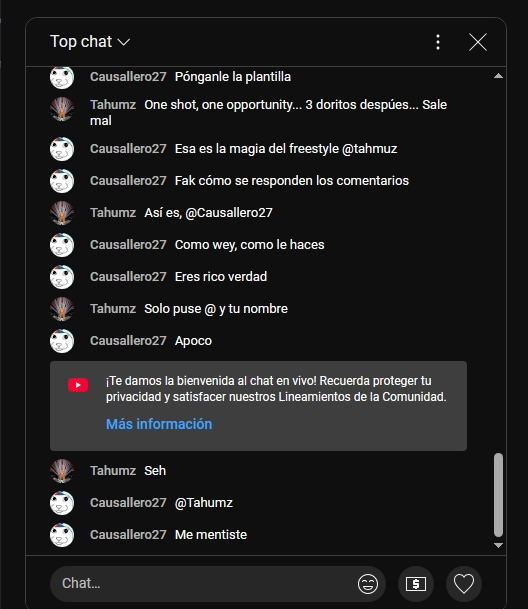
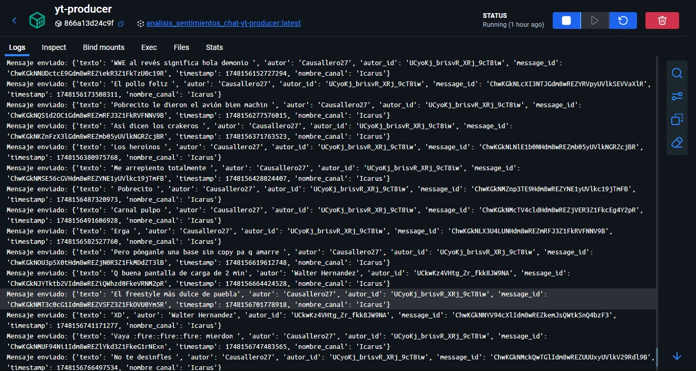
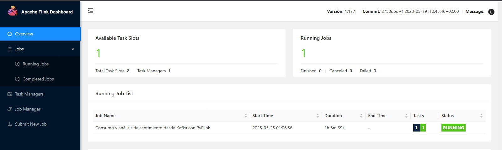
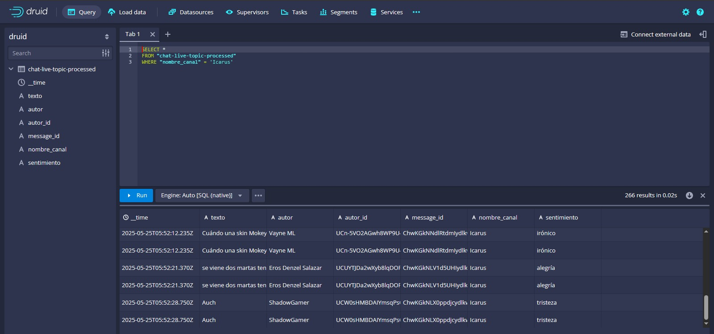
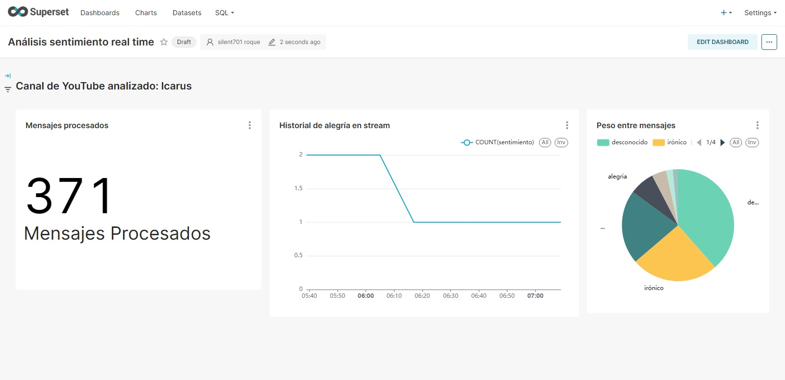
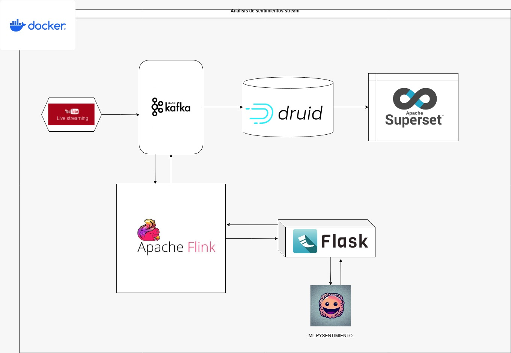

# 📊 Real-Time Sentiment Analysis of YouTube Live Chat (Spanish)
Este proyecto implementa un **pipeline de análisis de sentimiento en tiempo real** para mensajes de chat en vivo de transmisiones de YouTube en español. Usa una arquitectura de microservicios completamente contenedorizada con Docker Compose.

🎯 Además, este sistema fue diseñado como una prueba de concepto para mostrar habilidades prácticas en ingeniería de datos en tiempo real y procesamiento de flujo.

## 🔗 Documentación
https://deepwiki.com/symphony701/analisis_sentimiento_chat_realtime
---

## 📁 Estructura del Proyecto
```
├── flink/ # Trabajos de Apache Flink (PyFlink)
├── model-server/ # API Flask con el modelo de análisis de sentimiento
├── yt-producer/ # Productor de mensajes desde el chat en vivo de YouTube
├── docker-compose.yml # Orquestación de servicios
├── druid/ # Apache Druid (almacén OLAP)
├── superset/ # Apache Superset (dashboards)
└── LICENSE
```
---

## 🛠️ Tecnologías Utilizadas

### Principales
- **Apache Kafka**: Sistema de colas para transmisión de mensajes
- **Apache Zookeeper**: Coordinación de clúster Kafka
- **Apache Flink (PyFlink)**: Procesamiento de flujos en tiempo real
- **Flask**: Servidor REST para inferencia del modelo
- **Apache Druid**: Almacén OLAP para consultas analíticas en tiempo real
- **Apache Superset**: Dashboards interactivos sobre datos procesados
- **Docker Compose**: Orquestación de contenedores

### Librerías de Python
- `chat_downloader`: Extracción del chat de YouTube
- `kafka-python`: Cliente productor de Kafka
- `pysentimiento`: Modelos de análisis de sentimiento en español
- `requests`: Comunicación HTTP entre servicios

---

## ⚙️ Configuración

### Requisitos
- Docker
- Docker Compose

### Servicios y Puertos
| Servicio         | Puerto         |
|------------------|----------------|
| Kafka (broker)   | 9092 / 29092   |
| Flink Dashboard  | localhost:8081 |
| Flask API        | localhost:5000 |
| Superset UI      | localhost:8088 |
| Druid UI         | localhost:8888 |

### Despliegue
```bash
docker-compose up
El servicio init-kafka crea automáticamente los topics necesarios:

chat-live-topic

chat-live-topic-processed

Se respeta el orden de dependencias: Zookeeper → Kafka → Servicios
```

## 📥 Flujo de Datos
### Ingesta:
yt-producer/consumer_yt.py extrae mensajes en tiempo real del chat de YouTube y los publica en Kafka.




### Procesamiento:
flink/consumer_live_chat.py consume desde Kafka, llama a la API Flask (model-server/) y adjunta el sentimiento.



### Almacenamiento OLAP:
Los mensajes procesados se publican en Kafka y luego se insertan en Apache Druid para permitir consultas eficientes.


### Visualización:
Los datos en Druid se visualizan mediante Apache Superset, con dashboards de métricas en tiempo real.



## 🧠 API de Análisis de Sentimiento
Endpoint: POST /analyze
Categorías Detectadas
Emociones: anger, joy, sadness, fear, disgust, surprise

Polaridad: positive, negative, neutral

Ironía: ironic / not ironic

## 🧪 Ejemplo de Flujo


## 🔍 Observabilidad
Herramienta	Descripción
Flink Dashboard	Monitoreo de trabajos en localhost:8081
Apache Druid UI	Consultas OLAP y monitoreo de segmentos
Superset UI	Dashboards en tiempo real en localhost:8088
Logging	Logs detallados desde Flink y Flask

## 📝 Notas Finales
El sistema es tolerante a fallos gracias a los checkpoints automáticos de Flink.

Toda la arquitectura es modular y extensible, ideal para escalar o migrar a servicios en la nube.

Las métricas pueden visualizarse en tiempo real para hacer análisis de comunidad, comportamiento, y engagement.

## 💼 Autor y Contacto
Desarrollado por symphony701 como demostración técnica para habilidades en Data Engineering.
🔍 Buscando oportunidades como Data Engineer Junior.

LinkedIn: [https://www.linkedin.com/in/tu-linkedin/](https://www.linkedin.com/in/sebrn/)
